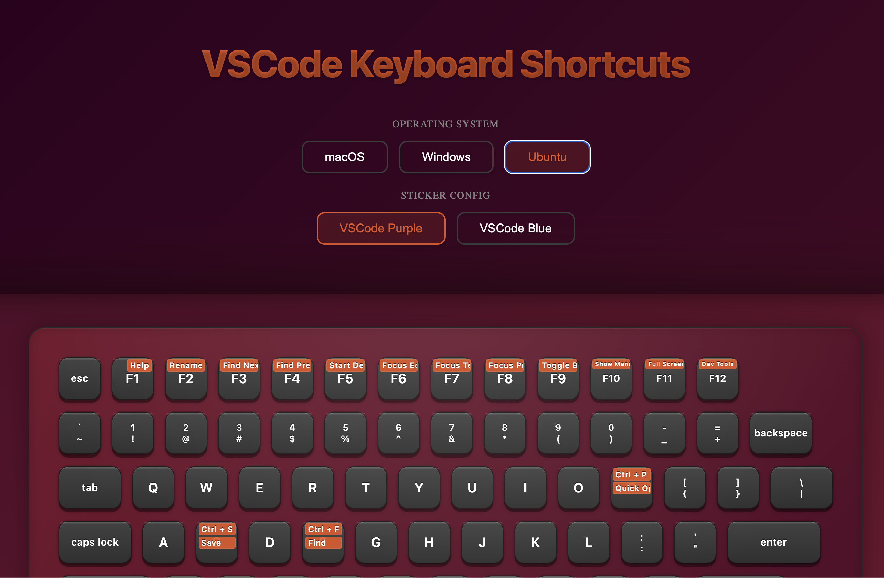

# VSCode Keyboard Stickers

An interactive keyboard sticker visualizer that displays VSCode shortcuts across different operating systems. Add beautiful, themed stickers to your keyboard layout with OS-specific shortcut hints.



## Features

- 🎨 Interactive sticker placement
- 💻 OS-specific sticker content
- 🎯 Multiple sticker themes (Purple, Blue)
- 🔄 Real-time theme switching
- 📱 Responsive sticker layout
- 🚀 Fast and lightweight

## Demo

Check out the live demo: [VSCode Keyboard Stickers](https://rakshitbharat.github.io/vscode-keyboard-shortcuts)

## Getting Started

1. Clone the repository:

```bash
git clone https://github.com/rakshitbharat/vscode-keyboard-shortcuts.git
cd vscode-keyboard-shortcuts
```

2. Install dependencies:

```bash
npm install
# or
yarn install
```

3. Run the development server:

```bash
npm run dev
# or
yarn dev
```

Open [http://localhost:3000](http://localhost:3000) with your browser to see the result.

## Contributing

Contributions are welcome! Here's how you can help:

1. Fork the repository
2. Create your feature branch (`git checkout -b feature/amazing-feature`)
3. Commit your changes (`git commit -m 'Add some amazing feature'`)
4. Push to the branch (`git push origin feature/amazing-feature`)
5. Open a Pull Request

### Adding New Sticker Themes

You can add new sticker themes by creating a new config file in `src/data/stickerConfigs/`:

```javascript
export default {
  id: "yourTheme",
  name: "Your Sticker Theme",
  description: "Your sticker theme description",
  styles: {
    // OS-specific sticker styles
  },
  layout: {
    // Sticker content and positions
  },
};
```

## Tech Stack

- [Next.js](https://nextjs.org/) - React framework
- [Styled Components](https://styled-components.com/) - Sticker styling
- [Redux Toolkit](https://redux-toolkit.js.org/) - State management
- [Redux Persist](https://github.com/rt2zz/redux-persist) - Theme persistence

## License

This project is licensed under the MIT License - see the [LICENSE](LICENSE) file for details.

## Acknowledgments

- Inspired by Visual Studio Code
- Icons from [Material Design Icons](https://materialdesignicons.com/)
- Font from [Inter](https://rsms.me/inter/)

## Support

If you like this project, please consider giving it a ⭐️!

Project Link: [https://github.com/rakshitbharat/vscode-keyboard-shortcuts](https://github.com/rakshitbharat/vscode-keyboard-shortcuts)
