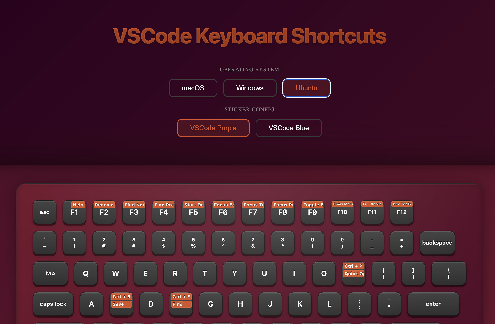

# VSCode Keyboard Stickers

An interactive keyboard sticker visualizer that displays VSCode shortcuts across different operating systems (macOS, Windows, Ubuntu). Create, customize, and share beautiful keyboard sticker themes.



## Features

- 🎨 Interactive sticker customization
- 💻 OS-specific shortcut layouts
  - macOS (⌘, ⌥, ⌃)
  - Windows (Ctrl, Alt, Win)
  - Ubuntu (Ctrl, Alt, Super)
- 🎯 Multiple built-in themes (Purple, Blue)
- 🔄 Real-time theme switching
- 📱 Responsive keyboard layout
- ✨ Custom sticker creation
- 🎬 Built-in image editor
- 🚀 Fast and lightweight

## Demo

Check out the live demo: [VSCode Keyboard Stickers](https://vscode-keyboard-sticker.vercel.app)

## Getting Started

1. Clone the repository:

```bash
git clone https://github.com/yourusername/vscode-keyboard-sticker.git
cd vscode-keyboard-sticker
```

2. Install dependencies:

```bash
npm install
# or
yarn install
```

3. Run the development server:

```bash
npm run dev
# or
yarn dev
```

Open [http://localhost:3000](http://localhost:3000) with your browser to see the result.

## Creating Custom Stickers

You can create custom stickers in several ways:

### 1. Using the Built-in Editor

1. Click on any key on the keyboard
2. Use the built-in image editor to:
   - Upload custom images
   - Crop and resize
   - Add filters and effects
   - Draw custom designs
   - Add text and icons

### 2. Using Component Stickers

Create custom React components for dynamic stickers:

```jsx
// src/components/stickers/MyCustomSticker.jsx
import styled from "styled-components";

const StickerContainer = styled.div`
  width: 100%;
  height: 100%;
  display: flex;
  align-items: center;
  justify-content: center;
  background: linear-gradient(45deg, #ff6b6b, #ff8e53);
`;

export const MyCustomSticker = () => (
  <StickerContainer>
    <span>⚡️</span>
  </StickerContainer>
);
```

### 3. Creating Theme Packs

1. Click "Create Theme" in the header
2. Fill in theme details:
   - Name
   - Display Name
   - Description
   - Author
3. Add stickers for each OS:
   - Upload images
   - Create custom components
   - Configure positions and styles
4. Export your theme pack

## Theme Structure

Themes are organized by operating system:

```
public/themes/your_theme_name/
├── mac/            # macOS specific stickers
│   ├── cmd.svg
│   ├── opt.svg
│   └── ...
├── windows/        # Windows specific stickers
│   ├── ctrl.svg
│   ├── alt.svg
│   └── ...
└── ubuntu/         # Ubuntu specific stickers
    ├── super.svg
    ├── meta.svg
    └── ...
```

## Available Components

The project includes several components for sticker customization:

- `ImageEditor`: Built-in image editing capabilities
- `StickerManager`: Manage and organize sticker collections
- `KeyManagementPopup`: Configure key-specific settings
- `StickerThemeManager`: Create and manage theme packs

## Contributing

Contributions are welcome! Here's how you can help:

1. Fork the repository
2. Create your feature branch (`git checkout -b feature/amazing-stickers`)
3. Create your stickers and themes
4. Commit your changes (`git commit -m 'Add some amazing stickers'`)
5. Push to the branch (`git push origin feature/amazing-stickers`)
6. Open a Pull Request

### Contributing Themes

1. Create a new theme using the theme creator
2. Test your theme across all operating systems
3. Submit a PR with your theme files:
   - Theme configuration
   - Sticker images
   - Custom components (if any)

## License

This project is licensed under the MIT License - see the [LICENSE](LICENSE) file for details.

## Support

If you like this project, please consider giving it a ⭐️!

## Acknowledgments

- Inspired by Visual Studio Code
- OS-specific keyboard layouts
- Community-contributed themes and stickers
- Built with Next.js and Styled Components

Project Link: [https://github.com/yourusername/vscode-keyboard-sticker](https://github.com/yourusername/vscode-keyboard-sticker)
